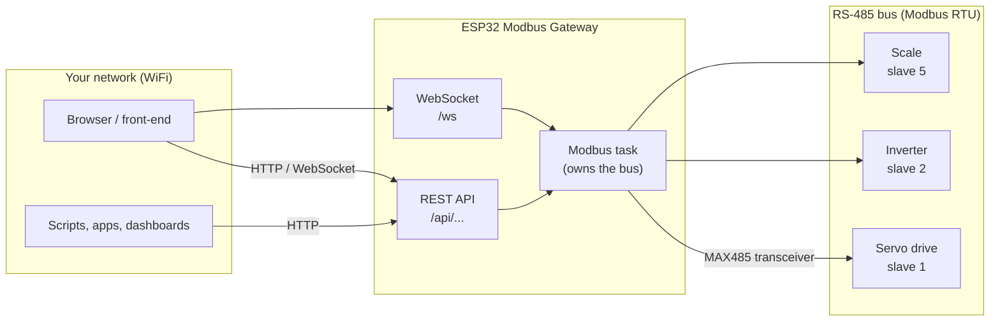
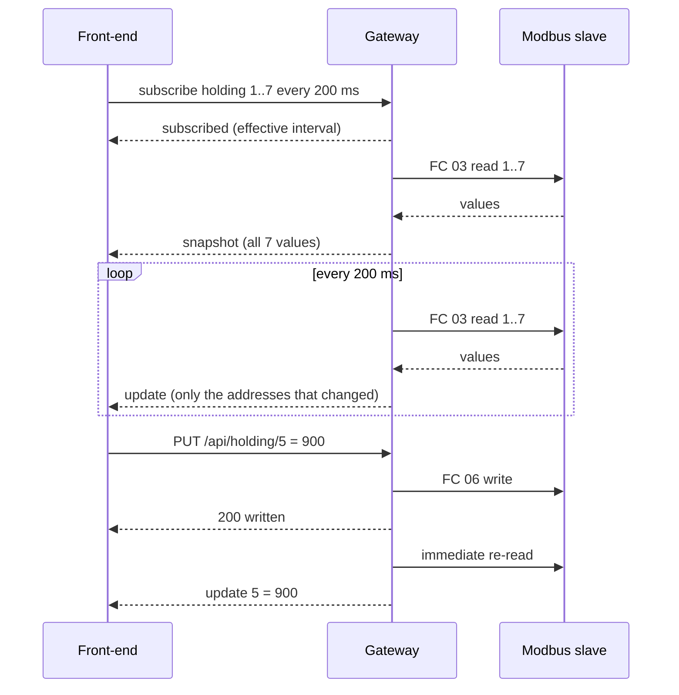
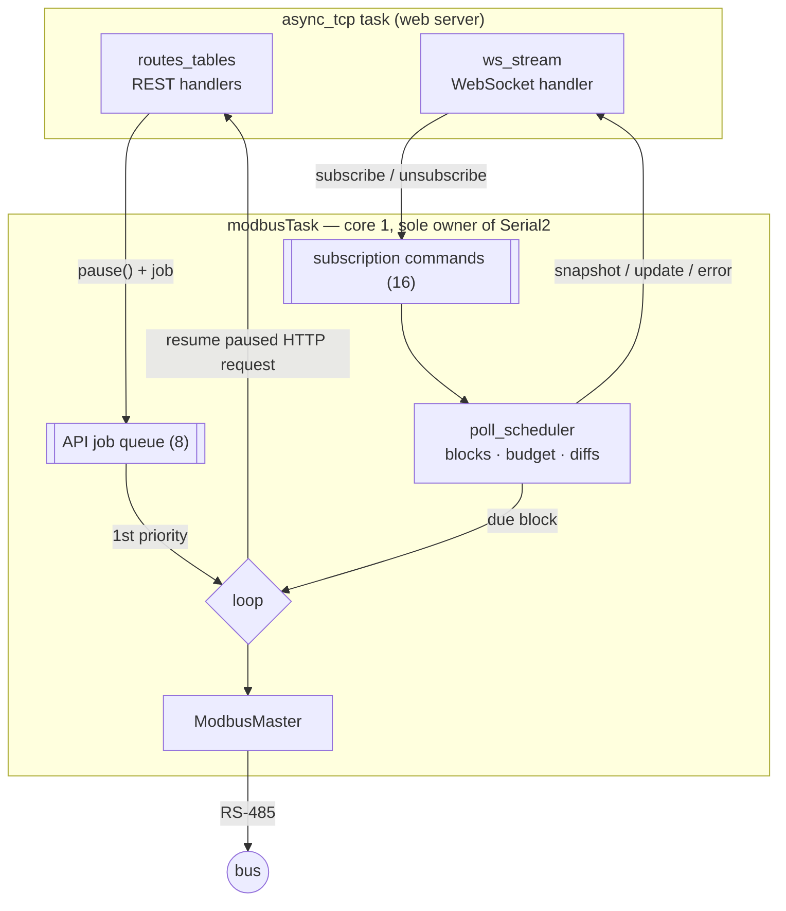

<div align="center">

# ESP32 Modbus Gateway

**Turn any Modbus RTU device into a local REST + WebSocket API — with a $10 board, no cloud, no PC.**


English · [Português](README.pt-BR.md)

</div>

---

An ESP32 firmware that acts as a **Modbus RTU master** on an RS-485 bus and exposes
every register of the connected devices — servo drives, inverters, scales, PLCs,
energy meters — as a **JSON REST API** and a **real-time WebSocket stream** on your
WiFi network. Any browser, phone app or script on the same network can read and
write industrial data with plain HTTP.

```bash
curl 'http://modbus-gateway.local/api/holding?start=1&count=4'
```
```json
{"table":"holding","slave":1,"functionCode":3,"startAddress":1,"count":4,
 "registers":[{"address":1,"value":1800},{"address":2,"value":350},
              {"address":3,"value":12},{"address":4,"value":0}]}
```

## Table of contents

- [Why this project exists](#why-this-project-exists)
- [Features](#features)
- [How it works](#how-it-works)
- [Hardware](#hardware)
- [Getting started](#getting-started)
- [Modbus in 2 minutes](#modbus-in-2-minutes)
- [REST API](#rest-api)
- [Real-time data (WebSocket)](#real-time-data-websocket)
- [Building a front-end](#building-a-front-end)
- [Configuration reference](#configuration-reference)
- [Architecture](#architecture)
- [Performance and limits](#performance-and-limits)
- [Troubleshooting](#troubleshooting)
- [Using it on a real industrial network](#using-it-on-a-real-industrial-network)
- [Project structure](#project-structure)
- [Roadmap](#roadmap)
- [Credits](#credits)

## Why this project exists

Industrial devices speak **Modbus RTU** over **RS-485**: a serial protocol from 1979
that is still the most common way to talk to drives, sensors and meters. It is
reliable and simple — but nothing modern can talk to it directly. A web page can't
open a serial port, a phone has no RS-485 connector, and the usual answers are
expensive: a commercial Modbus gateway, a PC running a SCADA system, or a cloud IoT
platform with a subscription.

This project is the smallest possible bridge between the two worlds:

| Without the gateway | With the gateway |
|---|---|
| A PC with a USB-RS485 adapter and vendor software next to the machine | Any device on the WiFi reads the machine from a browser |
| Custom serial code in every application | Plain `GET` / `PUT` with JSON, documented in Swagger |
| Polling loops in the front-end to see live values | A WebSocket pushes only the values that change |
| Cloud platform, account and subscription | Everything stays on the local network |

It was built with **replicability** as the main requirement: one cheap board, one
cheap transceiver module, flash the firmware and it works — easy for anyone to
reproduce.

## Features

- **REST API for all four Modbus tables** — holding registers, input registers, coils
  and discrete inputs — with any address range and any slave id (1-247) per request.
- **Each route maps to exactly one Modbus function** (FC 01-06, 15, 16), echoed back in
  every response as `functionCode`.
- **Confirmed writes**: a `PUT` answers `200` only after the slave acknowledged it.
- **Real-time WebSocket stream** (`/ws`): subscribe to ranges, get a snapshot and then
  only the changes. Deduplicates overlapping subscriptions, respects a bus-time budget,
  backs off failing devices and handles slow clients.
- **Honest errors**: slave timeouts, Modbus exceptions and bad frames become distinct
  HTTP status codes (`504`, `404`, `400`, `502`) carrying the original Modbus code —
  never silent zeros.
- **Front-end friendly**: CORS enabled (configurable origin), so a web app hosted anywhere
  on the network can call the API.
- **Built-in documentation**: Swagger UI at `/docs` (OpenAPI 3 spec embedded in the
  firmware) and a live WebSocket test page at `/ws-test`.
- **Zero infrastructure**: runs on the ESP32 alone, found on the network as
  `modbus-gateway.local` (mDNS).
- **Activity LED**: blinks on every successful Modbus reply — you can see the bus working.

## How it works



The ESP32 is the **master** of the RS-485 bus: it asks, the devices (slaves) answer.
A single background task owns the bus and executes every transaction in order, so HTTP
clients never collide on the wire:

1. A **REST request** arrives → the web server pauses it and queues a job → the Modbus
   task runs the transaction and answers the paused request. REST jobs always go first.
2. When no REST job is waiting, the task reads the next **subscribed range** that is due
   and pushes the changes to WebSocket clients.

## Hardware

### Bill of materials

| Part | Notes | Approx. cost |
|---|---|---|
| ESP32 DevKit (classic ESP32-WROOM-32, 30 or 38 pins) | Tested with a CP2102 USB-serial board (`board = esp32dev`) | US$ 5-10 |
| RS-485 transceiver module (MAX485 / MAX3485) | The common blue "MAX485 TTL to RS-485" module works | US$ 1-2 |
| Jumper wires | 7 wires | — |
| For bench tests: USB-RS485 adapter (CH340 / FTDI) | Lets a PC simulate a Modbus device | US$ 3-5 |
| 120 Ω resistor (optional) | Bus termination on long cables | — |

### Wiring

| MAX485 module pin | ESP32 pin | Purpose |
|---|---|---|
| **DI** | **GPIO17** (TX2) | Data from the ESP32 to the bus |
| **RO** | **GPIO16** (RX2) | Data from the bus to the ESP32 |
| **DE** + **RE** (bridged together) | **GPIO23** | HIGH = transmit, LOW = receive |
| **VCC** | **5V** / VIN (3V3 for a MAX3485) | Power |
| **GND** | **GND** | Common ground |
| **A** | → A (D+) of the bus | RS-485 differential pair |
| **B** | → B (D−) of the bus | RS-485 differential pair |

```
              ESP32 DevKit                     MAX485 module
        ┌──────────────────────┐          ┌─────────────────────┐
        │                GPIO17├──────────┤DI                  A├────┐
        │                GPIO16├──────────┤RO                  B├──┐ │
        │                GPIO23├────┬─────┤DE                   │  │ │
        │                      │    └─────┤RE                   │  │ │
        │                   5V ├──────────┤VCC                  │  │ │
        │                  GND ├──────────┤GND                  │  │ │
        │ [USB] power + logs   │          └─────────────────────┘  │ │
        └──────────────────────┘                                   │ │
                                          RS-485 bus  B (D−) ──────┘ │
                                          (twisted pair) A (D+) ─────┘
                                              │           │
                                     ┌────────┴──┐   ┌────┴────────┐
                                     │ slave 1   │   │ slave 2 ... │
                                     └───────────┘   └─────────────┘
```

> [!IMPORTANT]
> **TX goes to DI, RX goes to RO.** Swapping them is the most common wiring mistake and
> results in total silence in both directions (every request times out).

**RS-485 tips**

- **A/B naming is not consistent** between manufacturers. If everything times out and the
  wiring is otherwise right, swap A and B.
- The bus is a **daisy chain** (one cable going from device to device), not a star.
  Keep the ESP32's stub short.
- On long cables, put a **120 Ω terminator** at each physical end of the bus only.
  Many modules already have one on board.
- A MAX485 powered at 5V drives **5V on RO** into a 3.3V GPIO. It works on the bench;
  for a permanent install use a voltage divider (e.g. 1 kΩ + 2 kΩ) on RO or a 3.3V
  transceiver (MAX3485, SP3485).
- In electrically noisy panels (motors, inverters) prefer an **isolated** transceiver
  (e.g. ADM2483, ISO3082).

### Bench setup (no real device needed)

To develop without industrial hardware, simulate the slave on a computer:

```
ESP32 ──USB── Mac/PC (power + serial monitor)
  │
MAX485 ──A/B── USB-RS485 adapter ──USB── Mac/PC running a Modbus slave simulator
```

Simulators known to work: [Modbux](https://ploxc.com/modbux) (free, Windows/macOS/Linux)
and Modbus Server Pro (macOS). Configure the simulator as an **RTU server/slave** on the
adapter's serial port, **9600 baud, 8 data bits, no parity, 1 stop bit, unit/slave id 1**,
and create a few holding registers.

## Getting started

### 1. Prerequisites

- [PlatformIO](https://platformio.org/) — the VS Code extension or the CLI (`pip install platformio`).
- The ESP32 wired as above, connected by USB.
- A **2.4 GHz** WiFi network (the ESP32 can't join 5 GHz networks).

### 2. Clone

```bash
git clone https://github.com/magnurv12/esp32-modbus-gateway.git
cd esp32-modbus-gateway
```

### 3. Configure

**WiFi credentials** go in `include/secrets.h`, which is git-ignored so your password never
reaches the repository. Create it from the template:

```bash
cp include/secrets.example.h include/secrets.h
```

```cpp
// include/secrets.h
constexpr const char *WIFI_SSID = "your-network";      // 2.4 GHz only
constexpr const char *WIFI_PASSWORD = "your-password";
```

Without this file the build stops with *"Missing include/secrets.h"*.

**Everything else** is in [`include/config.h`](include/config.h) — at least check the bus
settings:

```cpp
constexpr uint32_t MODBUS_BAUD = 9600;                  // must match the bus
constexpr uint8_t DEFAULT_SLAVE_ID = 1;                 // used when ?slave= is omitted
```

Also set the serial port of **your** ESP32 in [`platformio.ini`](platformio.ini)
(`upload_port` / `monitor_port`). List ports with `ls /dev/cu.*` on macOS
(`/dev/ttyUSB*` on Linux, `COMx` on Windows). Pinning it prevents PlatformIO from picking
the USB-RS485 adapter by mistake.

### 4. Build and flash

```bash
pio run -t upload        # build + flash
pio device monitor       # serial logs at 115200
```

The boot log shows the address:

```
Conectando ao WiFi 'your-network'......
WiFi conectado, IP: 192.168.1.42
mDNS ativo: http://modbus-gateway.local/
```

### 5. Try it

| Open | What you get |
|---|---|
| `http://modbus-gateway.local/docs` | Swagger UI — every route, with "Try it out" |
| `http://modbus-gateway.local/ws-test` | Live WebSocket test page (works offline) |
| `http://modbus-gateway.local/api/health` | Gateway status (JSON) |

```bash
# read holding registers 1..7 of slave 1
curl 'http://modbus-gateway.local/api/holding?start=1&count=7'

# write 77 to holding register 2
curl -X PUT http://modbus-gateway.local/api/holding/2 \
     -H 'Content-Type: application/json' -d '{"value": 77}'
```

The onboard LED blinks on every successful Modbus reply. If it stays dark and the API
answers `504 slave_timeout`, see [Troubleshooting](#troubleshooting).

> `.local` names work out of the box on macOS, iOS, Linux and Windows 10+. On Android and
> some apps use the IP address shown in the boot log or in `/api/health` (`wifiIp`).

## Modbus in 2 minutes

A Modbus device exposes its data in **four independent tables**, each with addresses
0-65535. The device manual (its *register map*) tells what lives where.

| Table | Size | Access | Think of it as | Examples |
|---|---|---|---|---|
| **Coils** | 1 bit | read/write | Commands, digital outputs | run/stop, enable, reset alarm |
| **Discrete inputs** | 1 bit | read-only | Status flags, digital inputs | ready, fault, limit switch |
| **Input registers** | 16 bits | read-only | Measurements | actual speed, current, temperature, weight |
| **Holding registers** | 16 bits | read/write | Parameters and setpoints | target speed, ramps, configuration |

- Values are unsigned 16-bit on the wire. Signed, scaled (`1234` = `12.34 Hz`) and 32-bit
  values (two consecutive registers) are interpreted as the manual says.
- Manuals often use the legacy numbering `40001` = holding register **address 0**
  (`0xxxx` coils, `1xxxx` discrete inputs, `3xxxx` input registers, `4xxxx` holding).
  Being off by one is the most common mistake.
- Many drives don't use coils/discrete inputs at all and pack those bits into a
  holding register ("control word" / "status word").

## REST API

Base URL: `http://modbus-gateway.local`. Every response is JSON. Full, interactive
reference: **`/docs`** (source: [`docs/openapi.yaml`](docs/openapi.yaml)).

### Routes

`<table>` is `holding`, `input`, `coils` or `discrete`. Every route accepts an optional
`?slave=1..247`.

| Method | Route | Holding | Input | Coils | Discrete | Body |
|---|---|---|---|---|---|---|
| `GET` | `/api/<table>?start=N&count=N` | FC 03 | FC 04 | FC 01 | FC 02 | — |
| `GET` | `/api/<table>/{address}` | FC 03 | FC 04 | FC 01 | FC 02 | — |
| `PUT` | `/api/<table>/{address}` | FC 06 | 405 | FC 05 | 405 | `{"value": N}` / `{"state": true}` |
| `PUT` | `/api/<table>` | FC 16 | 405 | FC 15 | 405 | `{"startAddress": N, "values": [..]}` / `"states"` |
| `GET` | `/api/health` | | | | | — |

Modbus has no "read one" function: reads are always block reads, and `/{address}` is a
block of one. Writes do have single (05/06) and multiple (15/16) variants — the block
`PUT` always uses 15/16, even with a single value, so you choose what the device receives.

### Examples

```bash
# 10 coils starting at 0, slave 3
curl 'http://modbus-gateway.local/api/coils?start=0&count=10&slave=3'
# → {"table":"coils","slave":3,"functionCode":1,"startAddress":0,"count":10,
#    "states":[true,false,false,true,false,false,false,false,false,false]}

# one input register
curl http://modbus-gateway.local/api/input/7
# → {"table":"input","slave":1,"functionCode":4,"address":7,"value":2315}

# switch coil 1 on
curl -X PUT http://modbus-gateway.local/api/coils/1 \
     -H 'Content-Type: application/json' -d '{"state": true}'
# → {"table":"coils","slave":1,"functionCode":5,"address":1,"state":true,"status":"written"}

# write registers 10, 11 and 12 in one transaction (FC 16)
curl -X PUT http://modbus-gateway.local/api/holding \
     -H 'Content-Type: application/json' -d '{"startAddress": 10, "values": [100, 200, 300]}'
```

### Errors

```json
{"error":"slave_timeout","message":"The Modbus slave did not respond (check RS-485 wiring, slave id and baud rate)",
 "table":"holding","slave":1,"functionCode":3,"address":1,"count":2,"modbusCode":226,"modbusError":"ResponseTimedOut"}
```

| HTTP | `error` | Meaning |
|---|---|---|
| 400 | `invalid_address`, `missing_parameter`, `invalid_parameter`, `invalid_body` | Bad request — the bus wasn't touched |
| 400 | `illegal_function`, `illegal_value` | The device refused (Modbus exception 01 / 03) |
| 404 | `illegal_address` | The device has no data there (exception 02) |
| 404 | `not_found` | Unknown route |
| 405 | `read_only` | `PUT` on input registers / discrete inputs |
| 502 | `slave_failure`, `bad_response` | Device failure (exception 04) or corrupt reply (CRC, id) |
| 503 | `busy` | Too many requests queued for the bus (8) |
| 504 | `slave_timeout` | Nobody answered — wiring, slave id, baud rate |

> [!NOTE]
> Some simulators answer `0` for addresses they don't define instead of exception 02, so
> a `200` from a simulator doesn't prove the register exists. Real devices usually answer
> with the exception.

## Real-time data (WebSocket)

For values that must stay current, don't poll the REST API from the front-end: open a
WebSocket, **subscribe** to ranges and receive a **snapshot** followed by only the
**changes**. REST reads and writes keep working at the same time.



```js
const ws = new WebSocket('ws://modbus-gateway.local/ws');
const values = {};

ws.onopen = () => ws.send(JSON.stringify({
  op: 'subscribe', id: 'motor1', slave: 1, table: 'holding', start: 1, count: 7, intervalMs: 200,
}));

ws.onmessage = ({ data }) => {
  const msg = JSON.parse(data);
  if (msg.type === 'snapshot') msg.values.forEach((v, i) => (values[msg.startAddress + i] = v));
  if (msg.type === 'update') msg.changes.forEach(([address, v]) => (values[address] = v));
  if (msg.type === 'error') console.warn(msg.id, msg.error, `retry in ${msg.retryInMs} ms`);
};
// Subscriptions live as long as the connection: resubscribe after reconnecting.
```

What the gateway does for you:

- **Deduplication** — overlapping or adjacent subscriptions (from any client) become a
  single bus read.
- **Change-only push** — an idle dashboard generates no traffic.
- **Bus budget** — live polling may use at most 70% of the bus; if subscriptions ask for
  more, intervals are stretched and clients are told the `effectiveIntervalMs`.
- **Write feedback** — after a successful `PUT`, subscribers see the new value ~70 ms later.
- **Back-off** — a failing device is retried at 250 ms → 5 s instead of stalling the bus.
- **Slow clients** — updates are skipped and a fresh snapshot is sent when they catch up.

Full protocol, message types and limits: [`docs/websocket.md`](docs/websocket.md).

## Building a front-end

The gateway is designed to be the backend of a web dashboard (an example front-end will
live in a separate repository). The recommended split:

| Need | Use |
|---|---|
| Values on screen that must stay current | WebSocket subscriptions |
| User actions (start, stop, change a setpoint) | `PUT` on the REST API |
| One-off reads (forms, reports) | `GET` on the REST API |
| Connection / device status indicator | `GET /api/health` + WebSocket `error` messages |

Tips: keep one WebSocket per browser tab, reconnect with back-off and resend the
subscriptions, and treat values as stale after an `error` until the next `snapshot`.

**Calling the API from another origin (CORS).** A front-end running elsewhere — a dev
server on `localhost:5173`, another host on the network — can call the REST API directly:
every response carries `Access-Control-Allow-Origin` and preflight requests
(`OPTIONS /api/...`) are answered. This is controlled by `CORS_ALLOW_ORIGIN` in
`config.h`:

| Value | Effect |
|---|---|
| `"*"` (default) | Any web page can call the API — convenient for development |
| `"http://192.168.1.10:5173"` | Only pages from that exact origin |
| `""` | CORS disabled: browsers block cross-origin REST calls |

> [!WARNING]
> With `"*"` and no authentication, **any web page opened on a computer of the same
> network could write to your devices** through the browser. Restrict it to your
> front-end's origin before using the gateway with real equipment. The WebSocket isn't
> subject to CORS.

## Configuration reference

In [`include/config.h`](include/config.h), except the WiFi credentials (`include/secrets.h`):

| Constant | Default | Description |
|---|---|---|
| `WIFI_SSID` / `WIFI_PASSWORD` | — | 2.4 GHz network credentials — in `include/secrets.h` (git-ignored) |
| `MDNS_HOSTNAME` | `modbus-gateway` | Name on the network (`<name>.local`) |
| `MODBUS_BAUD` | `9600` | Bus speed (serial format is fixed at 8N1) |
| `DEFAULT_SLAVE_ID` | `1` | Slave used when a request has no `?slave=` |
| `RS485_TX_PIN` / `RS485_RX_PIN` / `DE_RE_PIN` | `17` / `16` / `23` | Transceiver pins |
| `MODBUS_RESPONSE_TIMEOUT_MS` | `400` | How long to wait for a reply (≥ 350 at 9600 baud) |
| `LED_PIN` / `LED_FLASH_MS` | `2` / `40` | Activity LED |
| `HTTP_PORT` | `80` | Web server port |
| `CORS_ALLOW_ORIGIN` | `"*"` | Origin allowed to call the REST API from a browser (`""` disables CORS) |
| `DEBUG_BAUD` | `115200` | Serial monitor speed |

Protocol limits live in [`include/modbus_types.h`](include/modbus_types.h) and WebSocket
limits in [`include/poll_scheduler.h`](include/poll_scheduler.h) /
[`include/ws_stream.h`](include/ws_stream.h).

## Architecture



- **One owner for the bus.** Only `modbusTask` touches `Serial2`, so there are no
  collisions and no locks around the serial port.
- **No blocking in the web server.** HTTP handlers use ESPAsyncWebServer's *request
  continuation* (`request->pause()`): they queue the job and return; the Modbus task
  answers the request when the transaction is done.
- **REST first.** The loop always drains API jobs before running a due poll, so a `PUT`
  waits at most for the poll transaction already on the wire.
- **Chunking.** Reads larger than ModbusMaster's 64-word buffer are split into several
  transactions; writes are always a single transaction.
- **Vendored ModbusMaster.** [`lib/ModbusMaster`](lib/ModbusMaster/VENDORED.md) is
  4-20ma/ModbusMaster 2.0.1 with a configurable response timeout (upstream is fixed at
  2 s, too long for live polling).

## Performance and limits

Measured on the bench (ESP32 over WiFi, simulator at 9600 baud):

| Operation | Time |
|---|---|
| REST read or write, round trip | ~110-150 ms |
| REST read served from a live subscription | ~20 ms |
| WebSocket subscribe → first snapshot | ~75 ms |
| `PUT` response → WebSocket update to subscribers | ~70 ms |
| Read 125 registers / 2000 coils | ~0.5 s / ~0.6 s |

The bus is the real limit: **one transaction at a time**, ~50 ms for ~10 registers at
9600 baud (~20 transactions per second in total). Higher baud rates scale almost linearly.

| Limit | Value |
|---|---|
| Registers / bits per read | 125 / 2000 |
| Values per write | 64 |
| Queued REST requests | 8 |
| WebSocket connections | 4 |
| Subscriptions per connection / total | 8 / 32 |
| Distinct polled ranges | 16 |
| Poll interval | 100 ms - 60 s (default 500 ms) |

## Troubleshooting

| Symptom | Likely cause / fix |
|---|---|
| Build fails: *Missing include/secrets.h* | Create it: `cp include/secrets.example.h include/secrets.h` and set your WiFi. |
| Browser console: *blocked by CORS policy* | `CORS_ALLOW_ORIGIN` doesn't match the page's origin (scheme + host + port), or is `""`. |
| Every request returns `504 slave_timeout`, LED dark | Wiring: **TX2→DI, RX2→RO**, DE+RE→GPIO23, A/B swapped, a broken wire, module without power. Then baud rate and slave id. |
| `504` with a simulator | Simulator not listening on the adapter port, or its **unit id is 0** (must match `slave`, default 1). Only one program can open the port at a time. |
| `404 illegal_address` | The device doesn't have (part of) that range. Check the manual — and the off-by-one numbering. |
| Values look wrong by one address | Manual uses 1-based numbering (`40001` = address 0). |
| Upload fails: *port busy* | A serial monitor is open. Close it (or `lsof /dev/cu.usbserial-XXXX`). |
| Upload fails: *could not open port* / wrong port | Adapter and ESP32 both show up as `usbserial`. Pin `upload_port` in `platformio.ini`; names change when replugged. |
| Upload fails: *chip stopped responding* | Flaky USB; retry, or lower `upload_speed`. |
| Garbage at the start of the serial monitor | Leftover bytes in the macOS USB driver buffer — harmless. |
| Can't reach `modbus-gateway.local` | Use the IP from the boot log; make sure the network is 2.4 GHz. |
| Red `#include` errors in VS Code, but it builds | IntelliSense indexed another env; select `env:esp32dev` in the status bar. |

## Using it on a real industrial network

> [!CAUTION]
> Read this before connecting the gateway to a running installation.

- **Only one master per RS-485 bus.** If a PLC or SCADA system already polls the bus,
  adding the gateway (another master) causes collisions that can break the plant's
  communication — and a PLC may stop machines on a communication fault. Use a dedicated
  bus or a spare serial port of the PLC, or talk to the PLC over Modbus TCP instead.
- **Writes move real equipment.** The API has no authentication yet: anyone on the
  network can write — and with `CORS_ALLOW_ORIGIN = "*"`, so can any web page opened on
  that network. Restrict CORS to your front-end's origin. Write only to addresses confirmed in the manual, and never rely on
  the gateway for safety functions — emergency stops and interlocks must stay hardwired.
- **Match the bus settings.** Industrial buses often use **19200 8E1** (even parity, the
  Modbus spec default); this firmware is fixed at 8N1 today.
- **Hardware for the field:** isolated transceiver, surge protection, 24 V → 5 V DC-DC
  supply, and an enclosure with decent WiFi signal.
- Always coordinate with whoever is responsible for the automation.

## Project structure

```
esp32-modbus-gateway/
├── include/
│   ├── config.h           # pins, baud, timeouts, CORS ← start here
│   ├── secrets.example.h  # template for secrets.h (WiFi, git-ignored)
│   ├── modbus_types.h     # tables, function codes, protocol limits
│   ├── modbus_task.h      # job/command types, bus task API
│   ├── poll_scheduler.h   # live-polling state and limits
│   ├── ws_stream.h        # WebSocket API
│   └── ...                # route and codec headers
├── src/
│   ├── main.cpp           # wiring everything together
│   ├── modbus_task.cpp    # the task that owns the RS-485 bus
│   ├── poll_scheduler.cpp # subscriptions → merged blocks, budget, diffs
│   ├── ws_stream.cpp      # /ws protocol
│   ├── routes_tables.cpp  # REST routes for the four tables
│   ├── routes_health.cpp  # /api/health
│   ├── routes_docs.cpp    # /docs, /ws-test, /api/openapi.yaml
│   ├── route_helpers.cpp  # parsing, validation, request continuation
│   ├── json_codec.cpp     # JSON responses and error mapping
│   ├── cors.cpp           # CORS headers + preflight
│   └── wifi_setup.cpp     # WiFi + mDNS
├── lib/ModbusMaster/      # vendored library (configurable timeout)
├── docs/
│   ├── openapi.yaml       # REST spec — embedded in the firmware
│   └── websocket.md       # WebSocket protocol
├── web/ws-test.html       # test page — embedded in the firmware
└── platformio.ini
```

## Roadmap

- [x] Modbus RTU master on RS-485, all four tables, any range, any slave id
- [x] REST API with confirmed writes and meaningful errors
- [x] Swagger documentation served by the device
- [x] Real-time WebSocket stream with subscriptions
- [x] CORS, so front-ends served from another origin can call the REST API
- [x] WiFi credentials kept out of the repository (`secrets.h`)
- [ ] WiFi setup without reflashing (captive portal + reset button)
- [ ] Configurable serial format (parity / stop bits) and baud rate at runtime
- [ ] Authentication for writes
- [ ] 32-bit and float values (two-register types)
- [ ] Example front-end (separate repository)
- [ ] One-click install from the browser (ESP Web Tools)
- [ ] Validation on a real servo network

## Credits

- [4-20ma/ModbusMaster](https://github.com/4-20ma/ModbusMaster) (Apache-2.0) — Modbus RTU master, vendored with a small change.
- [ESP32Async/ESPAsyncWebServer](https://github.com/ESP32Async/ESPAsyncWebServer) and
  [AsyncTCP](https://github.com/ESP32Async/AsyncTCP) — async HTTP and WebSocket server.
- [ArduinoJson](https://arduinojson.org/) — JSON serialization.
- [Swagger UI](https://swagger.io/tools/swagger-ui/) — API documentation page.
