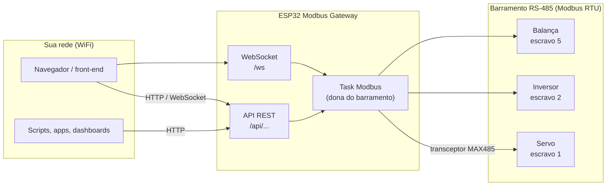
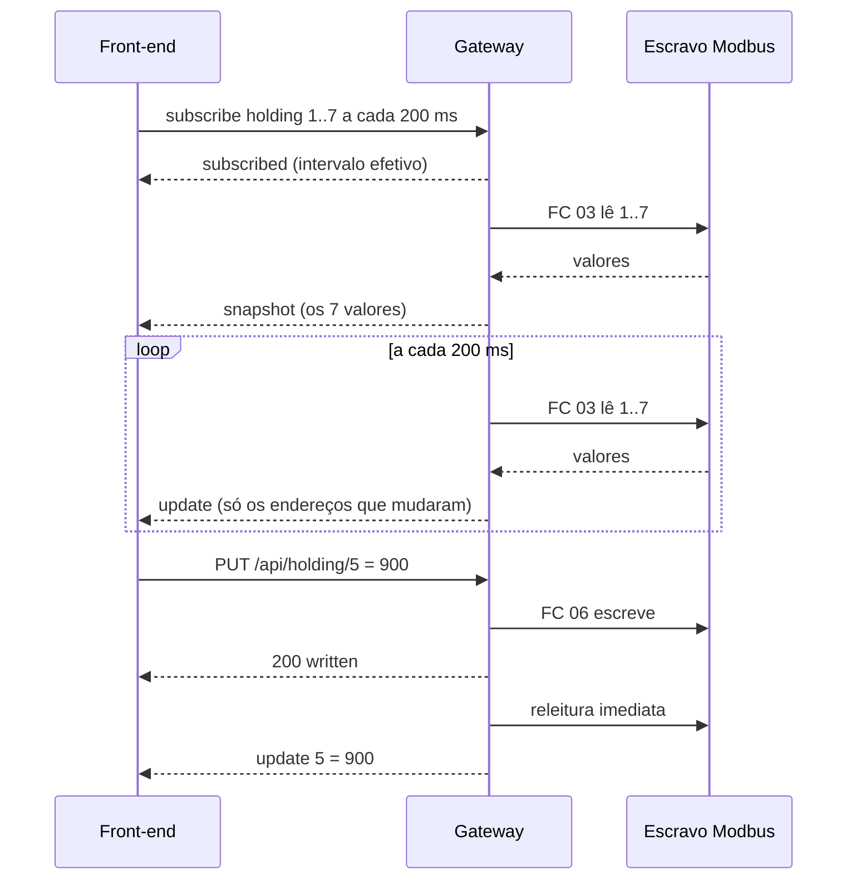
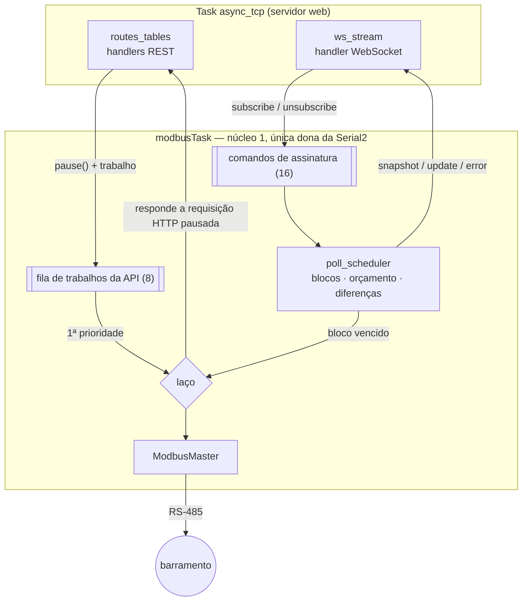

<div align="center">

# ESP32 Modbus Gateway

**Transforme qualquer equipamento Modbus RTU numa API REST + WebSocket local — com uma placa de R$ 50, sem nuvem e sem PC.**


[English](README.md) · Português

</div>

---

Firmware para ESP32 que atua como **mestre Modbus RTU** num barramento RS-485 e expõe
todos os registradores dos equipamentos conectados — servos, inversores, balanças, CLPs,
medidores de energia — como uma **API REST em JSON** e um **fluxo em tempo real via
WebSocket** na sua rede WiFi. Qualquer navegador, app de celular ou script na mesma rede
consegue ler e escrever dados industriais com HTTP simples.

```bash
curl 'http://modbus-gateway.local/api/holding?start=1&count=4'
```
```json
{"table":"holding","slave":1,"functionCode":3,"startAddress":1,"count":4,
 "registers":[{"address":1,"value":1800},{"address":2,"value":350},
              {"address":3,"value":12},{"address":4,"value":0}]}
```

## Sumário

- [Por que este projeto existe](#por-que-este-projeto-existe)
- [Funcionalidades](#funcionalidades)
- [Como funciona](#como-funciona)
- [Hardware](#hardware)
- [Primeiros passos](#primeiros-passos)
- [Modbus em 2 minutos](#modbus-em-2-minutos)
- [API REST](#api-rest)
- [Dados em tempo real (WebSocket)](#dados-em-tempo-real-websocket)
- [Construindo um front-end](#construindo-um-front-end)
- [Referência de configuração](#referência-de-configuração)
- [Arquitetura](#arquitetura)
- [Desempenho e limites](#desempenho-e-limites)
- [Solução de problemas](#solução-de-problemas)
- [Uso numa rede industrial real](#uso-numa-rede-industrial-real)
- [Estrutura do projeto](#estrutura-do-projeto)
- [Roadmap](#roadmap)
- [Créditos](#créditos)

## Por que este projeto existe

Equipamentos industriais falam **Modbus RTU** sobre **RS-485**: um protocolo serial de
1979 que ainda é o jeito mais comum de conversar com inversores, sensores e medidores. Ele é
confiável e simples — mas nada moderno fala com ele diretamente. Uma página web não abre
porta serial, um celular não tem conector RS-485, e as soluções de costume são caras: um
gateway Modbus comercial, um PC rodando supervisório, ou uma plataforma de IoT na nuvem com
assinatura.

Este projeto é a menor ponte possível entre os dois mundos:

| Sem o gateway | Com o gateway |
|---|---|
| Um PC com adaptador USB-RS485 e software do fabricante ao lado da máquina | Qualquer dispositivo no WiFi lê a máquina pelo navegador |
| Código serial próprio em cada aplicação | `GET` / `PUT` com JSON, documentado no Swagger |
| O front-end consultando a API em loop para ver valores ao vivo | Um WebSocket envia só os valores que mudaram |
| Plataforma na nuvem, conta e assinatura | Tudo fica na rede local |

O requisito principal desde o início foi **ser fácil de replicar**: uma placa barata, um
módulo transceptor barato, grava o firmware e funciona.

## Funcionalidades

- **API REST para as quatro tabelas Modbus** — holding registers, input registers, coils e
  discrete inputs — com qualquer faixa de endereços e qualquer slave id (1-247) por requisição.
- **Cada rota corresponde a exatamente uma função Modbus** (FC 01-06, 15, 16), informada em
  toda resposta no campo `functionCode`.
- **Escritas confirmadas**: um `PUT` só responde `200` depois que o escravo confirmou.
- **Fluxo em tempo real por WebSocket** (`/ws`): assine faixas, receba um snapshot e depois
  só as mudanças. Deduplica assinaturas sobrepostas, respeita um orçamento de uso do
  barramento, espera antes de tentar de novo um equipamento com falha e lida com clientes lentos.
- **Erros honestos**: timeout do escravo, exceções Modbus e pacotes corrompidos viram códigos
  HTTP distintos (`504`, `404`, `400`, `502`) com o código Modbus original — nunca zeros
  silenciosos.
- **Pronto para front-end**: CORS habilitado (origem configurável), então um app web
  hospedado em qualquer lugar da rede pode chamar a API.
- **Documentação embutida**: Swagger UI em `/docs` (especificação OpenAPI 3 gravada no
  firmware) e uma página de teste do WebSocket em `/ws-test`.
- **Zero infraestrutura**: roda só no ESP32 e aparece na rede como `modbus-gateway.local` (mDNS).
- **LED de atividade**: pisca a cada resposta Modbus bem-sucedida — dá para ver o barramento funcionando.

## Como funciona



O ESP32 é o **mestre** do barramento RS-485: ele pergunta e os equipamentos (escravos)
respondem. Uma única task em segundo plano é dona do barramento e executa cada transação em
ordem, então clientes HTTP nunca colidem no fio:

1. Chega uma **requisição REST** → o servidor web pausa a requisição e enfileira um trabalho →
   a task Modbus executa a transação e responde a requisição pausada. O REST sempre tem prioridade.
2. Quando não há trabalho REST esperando, a task lê a próxima **faixa assinada** que venceu
   o prazo e envia as mudanças para os clientes WebSocket.

## Hardware

### Lista de materiais

| Peça | Observações | Custo aprox. |
|---|---|---|
| ESP32 DevKit (ESP32-WROOM-32 clássico, 30 ou 38 pinos) | Testado com placa USB-serial CP2102 (`board = esp32dev`) | R$ 30-50 |
| Módulo transceptor RS-485 (MAX485 / MAX3485) | O módulo azul comum "MAX485 TTL para RS-485" funciona | R$ 5-10 |
| Jumpers | 7 fios | — |
| Para testes de bancada: adaptador USB-RS485 (CH340 / FTDI) | Permite que um PC simule um equipamento Modbus | R$ 15-25 |
| Resistor de 120 Ω (opcional) | Terminação do barramento em cabos longos | — |

### Ligações

| Pino do módulo MAX485 | Pino do ESP32 | Função |
|---|---|---|
| **DI** | **GPIO17** (TX2) | Dados do ESP32 para o barramento |
| **RO** | **GPIO16** (RX2) | Dados do barramento para o ESP32 |
| **DE** + **RE** (ligados juntos) | **GPIO23** | ALTO = transmite, BAIXO = recebe |
| **VCC** | **5V** / VIN (3V3 se for MAX3485) | Alimentação |
| **GND** | **GND** | Terra comum |
| **A** | → A (D+) do barramento | Par diferencial RS-485 |
| **B** | → B (D−) do barramento | Par diferencial RS-485 |

```
              ESP32 DevKit                     Módulo MAX485
        ┌──────────────────────┐          ┌─────────────────────┐
        │                GPIO17├──────────┤DI                  A├────┐
        │                GPIO16├──────────┤RO                  B├──┐ │
        │                GPIO23├────┬─────┤DE                   │  │ │
        │                      │    └─────┤RE                   │  │ │
        │                   5V ├──────────┤VCC                  │  │ │
        │                  GND ├──────────┤GND                  │  │ │
        │ [USB] alimentação+log│          └─────────────────────┘  │ │
        └──────────────────────┘                                   │ │
                                     Barramento RS-485  B (D−) ────┘ │
                                     (par trançado)     A (D+) ──────┘
                                              │           │
                                     ┌────────┴──┐   ┌────┴────────┐
                                     │ escravo 1 │   │ escravo 2...│
                                     └───────────┘   └─────────────┘
```

> [!IMPORTANT]
> **TX vai no DI e RX vai no RO.** Inverter os dois é o erro de ligação mais comum e causa
> silêncio total nos dois sentidos (toda requisição dá timeout).

**Dicas de RS-485**

- **A nomenclatura A/B não é padronizada** entre fabricantes. Se tudo dá timeout e o resto
  da ligação está certo, troque A e B.
- O barramento é em **série (varal)** — um cabo passando de equipamento em equipamento —, não em
  estrela. Mantenha a derivação até o ESP32 curta.
- Em cabos longos, coloque um **terminador de 120 Ω** somente nas duas pontas físicas do
  barramento. Muitos módulos já trazem um.
- Um MAX485 alimentado em 5V entrega **5V no RO**, que vai num GPIO de 3,3V. Na bancada
  funciona; numa instalação definitiva use um divisor de tensão no RO (ex.: 1 kΩ + 2 kΩ) ou um
  transceptor de 3,3V (MAX3485, SP3485).
- Em painéis com muito ruído elétrico (motores, inversores) prefira um transceptor
  **isolado** (ex.: ADM2483, ISO3082).

### Montagem de bancada (sem equipamento real)

Para desenvolver sem hardware industrial, simule o escravo num computador:

```
ESP32 ──USB── Mac/PC (alimentação + monitor serial)
  │
MAX485 ──A/B── adaptador USB-RS485 ──USB── Mac/PC rodando um simulador de escravo Modbus
```

Simuladores testados: [Modbux](https://ploxc.com/modbux) (grátis, Windows/macOS/Linux) e
Modbus Server Pro (macOS). Configure o simulador como **servidor/escravo RTU** na porta
serial do adaptador, **9600 baud, 8 bits de dados, sem paridade, 1 stop bit, unit/slave id 1**,
e crie alguns holding registers.

## Primeiros passos

### 1. Pré-requisitos

- [PlatformIO](https://platformio.org/) — a extensão do VS Code ou a linha de comando (`pip install platformio`).
- O ESP32 ligado como acima, conectado por USB.
- Uma rede WiFi **2,4 GHz** (o ESP32 não conecta em redes 5 GHz).

### 2. Clonar

```bash
git clone https://github.com/magnurv12/esp32-modbus-gateway.git
cd esp32-modbus-gateway
```

### 3. Configurar

**As credenciais do WiFi** ficam em `include/secrets.h`, que é ignorado pelo git — assim sua
senha nunca vai para o repositório. Crie o arquivo a partir do modelo:

```bash
cp include/secrets.example.h include/secrets.h
```

```cpp
// include/secrets.h
constexpr const char *WIFI_SSID = "sua-rede";          // somente 2,4 GHz
constexpr const char *WIFI_PASSWORD = "sua-senha";
```

Sem esse arquivo a compilação para com *"Missing include/secrets.h"*.

**O resto** está em [`include/config.h`](include/config.h) — confira pelo menos as
configurações do barramento:

```cpp
constexpr uint32_t MODBUS_BAUD = 9600;                  // igual ao barramento
constexpr uint8_t DEFAULT_SLAVE_ID = 1;                 // usado quando não há ?slave=
```

Ajuste também a porta serial do **seu** ESP32 no [`platformio.ini`](platformio.ini)
(`upload_port` / `monitor_port`). Liste as portas com `ls /dev/cu.*` no macOS
(`/dev/ttyUSB*` no Linux, `COMx` no Windows). Fixar a porta evita que o PlatformIO escolha o
adaptador USB-RS485 por engano.

### 4. Compilar e gravar

```bash
pio run -t upload        # compila + grava
pio device monitor       # logs seriais a 115200
```

O log de boot mostra o endereço:

```
Conectando ao WiFi 'sua-rede'......
WiFi conectado, IP: 192.168.1.42
mDNS ativo: http://modbus-gateway.local/
```

### 5. Testar

| Abra | O que você vê |
|---|---|
| `http://modbus-gateway.local/docs` | Swagger UI — todas as rotas, com "Try it out" |
| `http://modbus-gateway.local/ws-test` | Página de teste do WebSocket ao vivo (funciona offline) |
| `http://modbus-gateway.local/api/health` | Status do gateway (JSON) |

```bash
# lê os holding registers 1..7 do escravo 1
curl 'http://modbus-gateway.local/api/holding?start=1&count=7'

# escreve 77 no holding register 2
curl -X PUT http://modbus-gateway.local/api/holding/2 \
     -H 'Content-Type: application/json' -d '{"value": 77}'
```

O LED da placa pisca a cada resposta Modbus bem-sucedida. Se ele ficar apagado e a API
responder `504 slave_timeout`, veja [Solução de problemas](#solução-de-problemas).

> Nomes `.local` funcionam direto no macOS, iOS, Linux e Windows 10+. No Android e em alguns
> apps use o IP mostrado no log de boot ou no `/api/health` (`wifiIp`).

## Modbus em 2 minutos

Um equipamento Modbus expõe seus dados em **quatro tabelas independentes**, cada uma com
endereços de 0 a 65535. O manual do equipamento (o *mapa de registradores*) diz o que fica onde.

| Tabela | Tamanho | Acesso | Pense nela como | Exemplos |
|---|---|---|---|---|
| **Coils** | 1 bit | leitura/escrita | Comandos, saídas digitais | partir/parar, habilitar, reset de alarme |
| **Discrete inputs** | 1 bit | só leitura | Sinalizações, entradas digitais | pronto, falha, fim de curso |
| **Input registers** | 16 bits | só leitura | Medições | velocidade real, corrente, temperatura, peso |
| **Holding registers** | 16 bits | leitura/escrita | Parâmetros e setpoints | velocidade alvo, rampas, configuração |

- No fio, os valores são inteiros de 16 bits sem sinal. Valores com sinal, com escala
  (`1234` = `12,34 Hz`) e de 32 bits (dois registradores seguidos) são interpretados como o
  manual indica.
- Manuais costumam usar a numeração antiga `40001` = holding register **endereço 0**
  (`0xxxx` coils, `1xxxx` discrete inputs, `3xxxx` input registers, `4xxxx` holding).
  Ficar deslocado em um é o erro mais comum.
- Muitos inversores não usam coils/discrete inputs e colocam esses bits dentro de um holding
  register ("control word" / "status word").

## API REST

URL base: `http://modbus-gateway.local`. Toda resposta é JSON. Referência completa e
interativa: **`/docs`** (fonte: [`docs/openapi.yaml`](docs/openapi.yaml)).

### Rotas

`<table>` é `holding`, `input`, `coils` ou `discrete`. Toda rota aceita um `?slave=1..247` opcional.

| Método | Rota | Holding | Input | Coils | Discrete | Corpo |
|---|---|---|---|---|---|---|
| `GET` | `/api/<table>?start=N&count=N` | FC 03 | FC 04 | FC 01 | FC 02 | — |
| `GET` | `/api/<table>/{address}` | FC 03 | FC 04 | FC 01 | FC 02 | — |
| `PUT` | `/api/<table>/{address}` | FC 06 | 405 | FC 05 | 405 | `{"value": N}` / `{"state": true}` |
| `PUT` | `/api/<table>` | FC 16 | 405 | FC 15 | 405 | `{"startAddress": N, "values": [..]}` / `"states"` |
| `GET` | `/api/health` | | | | | — |

O Modbus não tem função de "ler um só": as leituras são sempre em bloco, e `/{address}` é um
bloco de um. As escritas têm versões simples (05/06) e múltiplas (15/16) — o `PUT` em bloco
sempre usa 15/16, mesmo com um valor só, para você escolher o que o equipamento recebe.

### Exemplos

```bash
# 10 coils a partir do 0, escravo 3
curl 'http://modbus-gateway.local/api/coils?start=0&count=10&slave=3'
# → {"table":"coils","slave":3,"functionCode":1,"startAddress":0,"count":10,
#    "states":[true,false,false,true,false,false,false,false,false,false]}

# um input register
curl http://modbus-gateway.local/api/input/7
# → {"table":"input","slave":1,"functionCode":4,"address":7,"value":2315}

# liga a coil 1
curl -X PUT http://modbus-gateway.local/api/coils/1 \
     -H 'Content-Type: application/json' -d '{"state": true}'
# → {"table":"coils","slave":1,"functionCode":5,"address":1,"state":true,"status":"written"}

# escreve os registradores 10, 11 e 12 numa única transação (FC 16)
curl -X PUT http://modbus-gateway.local/api/holding \
     -H 'Content-Type: application/json' -d '{"startAddress": 10, "values": [100, 200, 300]}'
```

### Erros

```json
{"error":"slave_timeout","message":"The Modbus slave did not respond (check RS-485 wiring, slave id and baud rate)",
 "table":"holding","slave":1,"functionCode":3,"address":1,"count":2,"modbusCode":226,"modbusError":"ResponseTimedOut"}
```

| HTTP | `error` | Significado |
|---|---|---|
| 400 | `invalid_address`, `missing_parameter`, `invalid_parameter`, `invalid_body` | Requisição inválida — o barramento nem foi usado |
| 400 | `illegal_function`, `illegal_value` | O equipamento recusou (exceção Modbus 01 / 03) |
| 404 | `illegal_address` | O equipamento não tem dados ali (exceção 02) |
| 404 | `not_found` | Rota inexistente |
| 405 | `read_only` | `PUT` em input registers / discrete inputs |
| 502 | `slave_failure`, `bad_response` | Falha do equipamento (exceção 04) ou resposta corrompida (CRC, id) |
| 503 | `busy` | Muitas requisições na fila do barramento (8) |
| 504 | `slave_timeout` | Ninguém respondeu — ligação, slave id, baud rate |

> [!NOTE]
> Alguns simuladores respondem `0` para endereços que não existem em vez da exceção 02,
> então um `200` vindo de simulador não prova que o registrador existe. Equipamentos reais
> normalmente respondem com a exceção.

## Dados em tempo real (WebSocket)

Para valores que precisam ficar atualizados, não consulte a API REST em loop no front-end:
abra um WebSocket, **assine** faixas e receba um **snapshot** seguido apenas das
**mudanças**. Leituras e escritas REST continuam funcionando ao mesmo tempo.



```js
const ws = new WebSocket('ws://modbus-gateway.local/ws');
const values = {};

ws.onopen = () => ws.send(JSON.stringify({
  op: 'subscribe', id: 'motor1', slave: 1, table: 'holding', start: 1, count: 7, intervalMs: 200,
}));

ws.onmessage = ({ data }) => {
  const msg = JSON.parse(data);
  if (msg.type === 'snapshot') msg.values.forEach((v, i) => (values[msg.startAddress + i] = v));
  if (msg.type === 'update') msg.changes.forEach(([address, v]) => (values[address] = v));
  if (msg.type === 'error') console.warn(msg.id, msg.error, `nova tentativa em ${msg.retryInMs} ms`);
};
// As assinaturas duram enquanto a conexão existir: assine de novo ao reconectar.
```

O que o gateway faz por você:

- **Deduplicação** — assinaturas sobrepostas ou vizinhas (de qualquer cliente) viram uma
  única leitura no barramento.
- **Envia só mudanças** — um painel parado não gera tráfego.
- **Orçamento do barramento** — a varredura ao vivo usa no máximo 70% do barramento; se as
  assinaturas pedirem mais, os intervalos são esticados e os clientes recebem o
  `effectiveIntervalMs`.
- **Retorno das escritas** — depois de um `PUT` bem-sucedido, quem assina vê o valor novo ~70 ms depois.
- **Espera progressiva** — um equipamento com falha é tentado de novo de 250 ms até 5 s, em
  vez de travar o barramento.
- **Clientes lentos** — atualizações são puladas e um snapshot novo é enviado quando o cliente se recupera.

Protocolo completo, tipos de mensagem e limites: [`docs/websocket.md`](docs/websocket.md) (em inglês).

## Construindo um front-end

O gateway foi pensado para ser o backend de um painel web (um front-end de exemplo vai
ficar num repositório separado). A divisão recomendada:

| Necessidade | Use |
|---|---|
| Valores na tela que precisam ficar atualizados | Assinaturas WebSocket |
| Ações do usuário (partir, parar, mudar um setpoint) | `PUT` na API REST |
| Leituras avulsas (formulários, relatórios) | `GET` na API REST |
| Indicador de conexão / status do equipamento | `GET /api/health` + mensagens `error` do WebSocket |

Dicas: use um WebSocket por aba do navegador, reconecte com espera progressiva e reenvie as
assinaturas, e trate os valores como desatualizados depois de um `error` até o próximo `snapshot`.

**Chamando a API de outra origem (CORS).** Um front-end rodando em outro lugar — um
servidor de desenvolvimento em `localhost:5173`, outro computador da rede — pode chamar a
API REST diretamente: toda resposta traz `Access-Control-Allow-Origin` e as requisições de
preflight (`OPTIONS /api/...`) são respondidas. Isso é controlado por `CORS_ALLOW_ORIGIN` no
`config.h`:

| Valor | Efeito |
|---|---|
| `"*"` (padrão) | Qualquer página web pode chamar a API — prático para desenvolvimento |
| `"http://192.168.1.10:5173"` | Só páginas exatamente dessa origem |
| `""` | CORS desligado: o navegador bloqueia chamadas REST de outra origem |

> [!WARNING]
> Com `"*"` e sem autenticação, **qualquer página web aberta num computador da mesma rede
> poderia escrever nos seus equipamentos** pelo navegador. Restrinja à origem do seu
> front-end antes de usar o gateway com equipamento real. O WebSocket não está sujeito a CORS.

## Referência de configuração

Em [`include/config.h`](include/config.h), exceto as credenciais do WiFi (`include/secrets.h`):

| Constante | Padrão | Descrição |
|---|---|---|
| `WIFI_SSID` / `WIFI_PASSWORD` | — | Credenciais da rede 2,4 GHz — em `include/secrets.h` (ignorado pelo git) |
| `MDNS_HOSTNAME` | `modbus-gateway` | Nome na rede (`<nome>.local`) |
| `MODBUS_BAUD` | `9600` | Velocidade do barramento (formato serial fixo em 8N1) |
| `DEFAULT_SLAVE_ID` | `1` | Escravo usado quando a requisição não tem `?slave=` |
| `RS485_TX_PIN` / `RS485_RX_PIN` / `DE_RE_PIN` | `17` / `16` / `23` | Pinos do transceptor |
| `MODBUS_RESPONSE_TIMEOUT_MS` | `400` | Quanto esperar pela resposta (≥ 350 a 9600 baud) |
| `LED_PIN` / `LED_FLASH_MS` | `2` / `40` | LED de atividade |
| `HTTP_PORT` | `80` | Porta do servidor web |
| `CORS_ALLOW_ORIGIN` | `"*"` | Origem que pode chamar a API REST pelo navegador (`""` desliga o CORS) |
| `DEBUG_BAUD` | `115200` | Velocidade do monitor serial |

Os limites do protocolo ficam em [`include/modbus_types.h`](include/modbus_types.h) e os do
WebSocket em [`include/poll_scheduler.h`](include/poll_scheduler.h) /
[`include/ws_stream.h`](include/ws_stream.h).

## Arquitetura



- **Um único dono do barramento.** Só a `modbusTask` usa a `Serial2`, então não há colisões
  nem travas em volta da porta serial.
- **O servidor web nunca bloqueia.** Os handlers HTTP usam a *request continuation* do
  ESPAsyncWebServer (`request->pause()`): enfileiram o trabalho e retornam; a task Modbus
  responde a requisição quando a transação termina.
- **REST primeiro.** O laço sempre esvazia a fila da API antes de executar uma varredura
  vencida, então um `PUT` espera no máximo a transação de varredura que já está no fio.
- **Divisão em partes.** Leituras maiores que o buffer de 64 palavras da ModbusMaster são
  divididas em várias transações; escritas são sempre uma transação só.
- **ModbusMaster embutida.** [`lib/ModbusMaster`](lib/ModbusMaster/VENDORED.md) é a
  4-20ma/ModbusMaster 2.0.1 com timeout de resposta configurável (a original é fixa em 2 s,
  longo demais para varredura ao vivo).

## Desempenho e limites

Medido na bancada (ESP32 via WiFi, simulador a 9600 baud):

| Operação | Tempo |
|---|---|
| Leitura ou escrita REST, ida e volta | ~110-150 ms |
| Leitura REST atendida por uma assinatura ao vivo | ~20 ms |
| Assinatura WebSocket → primeiro snapshot | ~75 ms |
| Resposta do `PUT` → update no WebSocket para quem assina | ~70 ms |
| Ler 125 registradores / 2000 coils | ~0,5 s / ~0,6 s |

O limite real é o barramento: **uma transação por vez**, ~50 ms para ~10 registradores a
9600 baud (~20 transações por segundo no total). Velocidades maiores escalam quase linearmente.

| Limite | Valor |
|---|---|
| Registradores / bits por leitura | 125 / 2000 |
| Valores por escrita | 64 |
| Requisições REST na fila | 8 |
| Conexões WebSocket | 4 |
| Assinaturas por conexão / total | 8 / 32 |
| Faixas distintas varridas | 16 |
| Intervalo de varredura | 100 ms - 60 s (padrão 500 ms) |

## Solução de problemas

| Sintoma | Causa provável / solução |
|---|---|
| Compilação falha: *Missing include/secrets.h* | Crie o arquivo: `cp include/secrets.example.h include/secrets.h` e coloque seu WiFi. |
| Console do navegador: *blocked by CORS policy* | `CORS_ALLOW_ORIGIN` não bate com a origem da página (protocolo + host + porta), ou está `""`. |
| Toda requisição volta `504 slave_timeout`, LED apagado | Ligação: **TX2→DI, RX2→RO**, DE+RE→GPIO23, A/B trocados, fio partido, módulo sem alimentação. Depois, baud rate e slave id. |
| `504` com simulador | Simulador não está escutando na porta do adaptador, ou o **unit id dele é 0** (precisa bater com `slave`, padrão 1). Só um programa por vez consegue abrir a porta. |
| `404 illegal_address` | O equipamento não tem (parte d)essa faixa. Confira o manual — e a numeração deslocada em um. |
| Valores parecem deslocados em um endereço | O manual usa numeração a partir de 1 (`40001` = endereço 0). |
| Upload falha: *port busy* | Há um monitor serial aberto. Feche-o (ou `lsof /dev/cu.usbserial-XXXX`). |
| Upload falha: *could not open port* / porta errada | Adaptador e ESP32 aparecem os dois como `usbserial`. Fixe `upload_port` no `platformio.ini`; os nomes mudam ao replugar. |
| Upload falha: *chip stopped responding* | USB instável; tente de novo ou reduza o `upload_speed`. |
| Lixo no começo do monitor serial | Bytes acumulados no driver USB do macOS — inofensivo. |
| Não acessa `modbus-gateway.local` | Use o IP do log de boot; confirme que a rede é 2,4 GHz. |
| `#include` em vermelho no VS Code, mas compila | O IntelliSense indexou outro ambiente; selecione `env:esp32dev` na barra de status. |

## Uso numa rede industrial real

> [!CAUTION]
> Leia isto antes de ligar o gateway numa instalação em funcionamento.

- **Só pode haver um mestre por barramento RS-485.** Se um CLP ou supervisório já consulta
  o barramento, adicionar o gateway (outro mestre) causa colisões que podem derrubar a
  comunicação da planta — e um CLP pode parar máquinas por falha de comunicação. Use um
  barramento dedicado ou uma porta serial livre do CLP, ou converse com o CLP por Modbus TCP.
- **Escritas movem equipamentos reais.** A API ainda não tem autenticação: qualquer um na
  rede pode escrever — e, com `CORS_ALLOW_ORIGIN = "*"`, qualquer página web aberta nessa
  rede também. Restrinja o CORS à origem do seu front-end. Escreva só em endereços confirmados no manual e nunca dependa do gateway
  para funções de segurança — emergência e intertravamentos devem continuar no hardware.
- **Use as mesmas configurações do barramento.** Barramentos industriais usam muito
  **19200 8E1** (paridade par, o padrão da especificação Modbus); este firmware hoje é fixo em 8N1.
- **Hardware de campo:** transceptor isolado, proteção contra surtos, fonte DC-DC de
  24 V → 5 V e um gabinete com sinal de WiFi razoável.
- Sempre combine com o responsável pela automação.

## Estrutura do projeto

```
esp32-modbus-gateway/
├── include/
│   ├── config.h           # pinos, baud, timeouts, CORS ← comece aqui
│   ├── secrets.example.h  # modelo do secrets.h (WiFi, ignorado pelo git)
│   ├── modbus_types.h     # tabelas, códigos de função, limites do protocolo
│   ├── modbus_task.h      # tipos de trabalho/comando, API da task do barramento
│   ├── poll_scheduler.h   # estado e limites da varredura ao vivo
│   ├── ws_stream.h        # API do WebSocket
│   └── ...                # cabeçalhos das rotas e do codec
├── src/
│   ├── main.cpp           # liga todas as partes
│   ├── modbus_task.cpp    # a task dona do barramento RS-485
│   ├── poll_scheduler.cpp # assinaturas → blocos agrupados, orçamento, diferenças
│   ├── ws_stream.cpp      # protocolo do /ws
│   ├── routes_tables.cpp  # rotas REST das quatro tabelas
│   ├── routes_health.cpp  # /api/health
│   ├── routes_docs.cpp    # /docs, /ws-test, /api/openapi.yaml
│   ├── route_helpers.cpp  # parsing, validação, request continuation
│   ├── json_codec.cpp     # respostas JSON e mapeamento de erros
│   ├── cors.cpp           # cabeçalhos CORS + preflight
│   └── wifi_setup.cpp     # WiFi + mDNS
├── lib/ModbusMaster/      # biblioteca embutida (timeout configurável)
├── docs/
│   ├── openapi.yaml       # especificação REST — gravada no firmware
│   └── websocket.md       # protocolo WebSocket
├── web/ws-test.html       # página de teste — gravada no firmware
└── platformio.ini
```

## Roadmap

- [x] Mestre Modbus RTU em RS-485, as quatro tabelas, qualquer faixa, qualquer slave id
- [x] API REST com escritas confirmadas e erros claros
- [x] Documentação Swagger servida pelo próprio equipamento
- [x] Fluxo em tempo real por WebSocket com assinaturas
- [x] CORS, para front-ends servidos de outra origem chamarem a API REST
- [x] Credenciais do WiFi fora do repositório (`secrets.h`)
- [ ] Configurar o WiFi sem regravar o firmware (portal cativo + botão de reset)
- [ ] Formato serial (paridade / stop bits) e baud rate configuráveis em tempo de execução
- [ ] Autenticação para escritas
- [ ] Valores de 32 bits e float (tipos de dois registradores)
- [ ] Front-end de exemplo (repositório separado)
- [ ] Instalação com um clique pelo navegador (ESP Web Tools)
- [ ] Validação numa rede real de servos

## Créditos

- [4-20ma/ModbusMaster](https://github.com/4-20ma/ModbusMaster) (Apache-2.0) — mestre Modbus RTU, embutida com uma pequena alteração.
- [ESP32Async/ESPAsyncWebServer](https://github.com/ESP32Async/ESPAsyncWebServer) e
  [AsyncTCP](https://github.com/ESP32Async/AsyncTCP) — servidor HTTP e WebSocket assíncrono.
- [ArduinoJson](https://arduinojson.org/) — serialização JSON.
- [Swagger UI](https://swagger.io/tools/swagger-ui/) — página de documentação da API.
